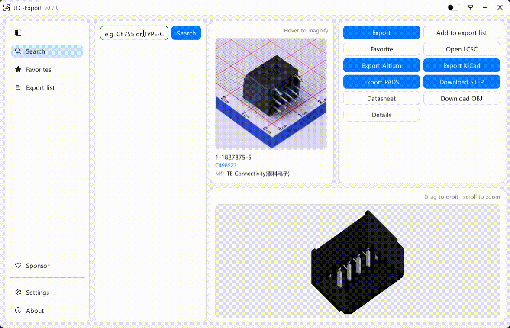

**Language / 语言:** **English** · [中文](README_ZH.md)

# JLC-Export

[](https://github.com/LZJ-I/JLC-Export)

Written in Rust. Search parts by MPN or LCSC id, download STEP / OBJ, and export Altium (`.SchLib` / `.PcbLib`), KiCad (`.kicad_sym` / `.pretty`), and classic PADS Logic / Layout ASCII (`.c` / `.d` / `.p`). The UI is Chinese / English.

If this project helps you, please [⭐ Star](https://github.com/LZJ-I/JLC-Export) it.



Licensed under [CC BY-NC-4.0](https://creativecommons.org/licenses/by-nc/4.0/).

## Install

Download the Windows 64-bit zip from [Releases](https://github.com/LZJ-I/JLC-Export/releases), unzip, and run `lceda.exe`. To update, unzip over the previous files, or use in-app update (downloads, replaces, restarts).

Or build from source (requires [Rust](https://rustup.rs/)):

```bash
cargo build --release -p lceda --target x86_64-pc-windows-msvc
```

## GUI

Double-click `lceda.exe`. Files go to `lceda-out` under your Downloads folder by default. Change the path on the right, or click **Open folder**.

Each part gets a subfolder named `MPN_LCSC_Manufacturer`. Files inside use the MPN.

1. Type an MPN (e.g. `STM32F103C8T6`) or LCSC id (e.g. `C8734`), then press Enter or **Search**.
2. Select a part on the left. Photo on the top right; drag in the lower half to orbit the 3D outline.
3. Use the buttons on the right:
   - **Download STEP / OBJ**: 3D models
   - **Export Altium**: `.SchLib` / `.PcbLib` (EasyEDA JSON is kept too)
   - **Export KiCad**: `.kicad_sym` and `.pretty` (writes `.3dshapes` and a footprint model ref when a STEP exists)
   - **Export PADS**: `.c` schematic decal, `.d` PCB decal, `.p` part type (classic Logic / Layout; not PADS Professional / Xpedition Central Library)
   - **Datasheet**: PDF. LCSC often gives an HTML page; the app pulls the real PDF from it
   - **Open LCSC**: Chinese product page (`item.szlcsc.com`)
   - **Batch file…**: tick the formats you want, then pick a text file, one id or keyword per line

Dimmed buttons mean this part has no matching asset. Click anyway for a notice; no empty folder is created.

**Settings** (top right) controls whether Altium export embeds STEP in the PcbLib and whether KiCad export writes `.3dshapes`. Both default on; a missing model is skipped, not a failure.

Exporting Altium / KiCad / PADS also keeps EasyEDA JSON for inspection.

### Batch file

One MPN or LCSC id per line. Lines starting with `#` or `//` are comments. In the GUI, **Batch file…** opens a checklist so you can export only some formats (PADS only, Altium only, etc.).

```
# example
C8734
STM32F030C8T6
C2040
```

## CLI

No arguments opens the GUI.

```bash
lceda search C2040
lceda get C2040 --step --ad --kicad --pads -o ./out
lceda get C2040 --kicad --no-kicad-3d -o ./out
lceda get C2040 --ad --no-ad-3d -o ./out
lceda get C2040 --source -o ./out
lceda get C2040 --datasheet -o ./out
lceda batch ids.txt --ad --kicad --pads --step -o ./out
lceda --lang zh gui
```

`batch` uses the same file format; CLI flags (`--ad`, `--kicad`, `--pads`, …) pick the types.

## Notes

Check exported libraries in Altium / KiCad / PADS before using them. This tool talks to unofficial LCSC / EasyEDA APIs, which may change.

## About

- Author: [LZJ-I](https://github.com/LZJ-I)
- Repository: [LZJ-I/JLC-Export](https://github.com/LZJ-I/JLC-Export)
- License: [CC BY-NC-4.0](https://creativecommons.org/licenses/by-nc/4.0/)

If it helps, please [Star](https://github.com/LZJ-I/JLC-Export) the repo.
